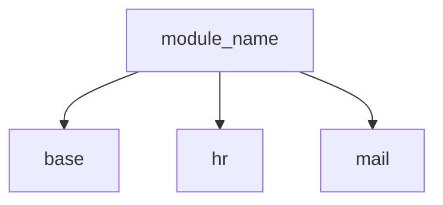
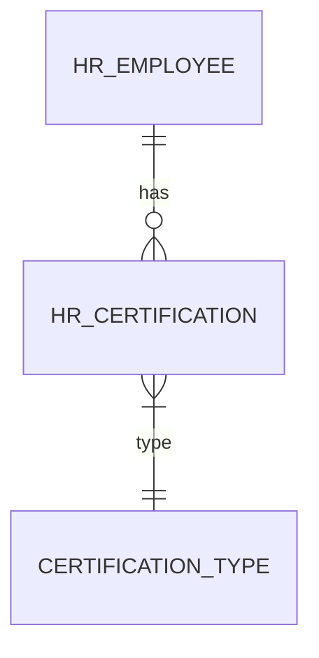

# Update Codemaps

Analyze the Odoo module structure and update architecture documentation:

1. Scan all Python source files for models, fields, and dependencies

2. Generate token-lean codemaps in the following format:
   - `codemaps/architecture.md` - Overall module architecture
   - `codemaps/models.md` - Model definitions and relationships
   - `codemaps/views.md` - View structure and inheritance
   - `codemaps/security.md` - Access rights and record rules

3. Calculate diff percentage from previous version

4. If changes > 30%, request user approval before updating

5. Add freshness timestamp to each codemap

6. Save reports to `.reports/codemap-diff.txt`

## Analysis Methods

### Model Analysis (Python AST)

```python
import ast
import os

def analyze_models(module_path: str) -> dict:
    """Extract model information from Python files."""
    models = {}

    for root, dirs, files in os.walk(os.path.join(module_path, 'models')):
        for file in files:
            if file.endswith('.py') and not file.startswith('__'):
                filepath = os.path.join(root, file)
                with open(filepath) as f:
                    tree = ast.parse(f.read())

                for node in ast.walk(tree):
                    if isinstance(node, ast.ClassDef):
                        model_info = extract_model_info(node)
                        if model_info:
                            models[model_info['name']] = model_info

    return models

def extract_model_info(class_node: ast.ClassDef) -> dict:
    """Extract model name, inherit, fields from class definition."""
    info = {
        'class_name': class_node.name,
        'name': None,
        'inherit': None,
        'description': None,
        'fields': [],
    }

    for node in class_node.body:
        if isinstance(node, ast.Assign):
            for target in node.targets:
                if isinstance(target, ast.Name):
                    if target.id == '_name':
                        info['name'] = extract_string_value(node.value)
                    elif target.id == '_inherit':
                        info['inherit'] = extract_string_value(node.value)
                    elif target.id == '_description':
                        info['description'] = extract_string_value(node.value)
                    elif is_field_definition(node.value):
                        info['fields'].append({
                            'name': target.id,
                            'type': get_field_type(node.value),
                        })

    return info if info['name'] or info['inherit'] else None
```

### View Analysis (XML)

```python
import xml.etree.ElementTree as ET

def analyze_views(module_path: str) -> dict:
    """Extract view information from XML files."""
    views = {}

    for root, dirs, files in os.walk(os.path.join(module_path, 'views')):
        for file in files:
            if file.endswith('.xml'):
                filepath = os.path.join(root, file)
                tree = ET.parse(filepath)

                for record in tree.findall('.//record[@model="ir.ui.view"]'):
                    view_info = {
                        'id': record.get('id'),
                        'name': get_field_value(record, 'name'),
                        'model': get_field_value(record, 'model'),
                        'inherit_id': get_field_ref(record, 'inherit_id'),
                    }
                    views[view_info['id']] = view_info

    return views
```

### Security Analysis

```python
import csv

def analyze_security(module_path: str) -> dict:
    """Extract security information from CSV and XML files."""
    security = {
        'acls': [],
        'rules': [],
        'groups': [],
    }

    # Parse ir.model.access.csv
    acl_path = os.path.join(module_path, 'security', 'ir.model.access.csv')
    if os.path.exists(acl_path):
        with open(acl_path) as f:
            reader = csv.DictReader(f)
            for row in reader:
                security['acls'].append(row)

    # Parse security.xml for record rules and groups
    security_xml = os.path.join(module_path, 'security', 'security.xml')
    if os.path.exists(security_xml):
        tree = ET.parse(security_xml)
        for rule in tree.findall('.//record[@model="ir.rule"]'):
            security['rules'].append({
                'id': rule.get('id'),
                'name': get_field_value(rule, 'name'),
                'model': get_field_ref(rule, 'model_id'),
            })

    return security
```

## Codemap Format

### architecture.md

```markdown
# Module Architecture: module_name

**Generated**: 2024-01-15 10:30:00
**Version**: 15.0.1.0.0

## Overview

```
module_name/
├── models/           # 5 models, 45 fields
├── views/            # 12 views (4 forms, 4 trees, 4 search)
├── security/         # 2 groups, 4 ACLs, 3 rules
├── data/             # 2 cron jobs
├── wizards/          # 1 wizard
└── tests/            # 8 test files
```

## Dependencies



## Model Relationships


```

### models.md

```markdown
# Models: module_name

**Generated**: 2024-01-15 10:30:00

## Model Summary

| Model | Description | Fields | Computed | Inherited |
|-------|-------------|--------|----------|-----------|
| hr.certification | Employee Certification | 8 | 2 | No |
| hr.employee | (extends) | +2 | +1 | Yes |

## hr.certification

**File**: models/hr_certification.py:15

| Field | Type | Required | Stored |
|-------|------|----------|--------|
| name | Char | Yes | Yes |
| employee_id | Many2one | Yes | Yes |
| date_expiry | Date | No | Yes |
| state | Selection | No | Yes (computed) |

**Methods**:
- `_compute_state()` - Compute certification state
- `action_renew()` - Renew certification
```

## Diff Detection

```bash
# Compare current vs previous codemap
diff -u codemaps/models.md.bak codemaps/models.md > .reports/codemap-diff.txt

# Calculate change percentage
LINES_CHANGED=$(wc -l < .reports/codemap-diff.txt)
TOTAL_LINES=$(wc -l < codemaps/models.md)
CHANGE_PERCENT=$((LINES_CHANGED * 100 / TOTAL_LINES))

if [ $CHANGE_PERCENT -gt 30 ]; then
    echo "⚠️ Major changes detected ($CHANGE_PERCENT%). Requesting approval..."
fi
```

## Running Commands

```bash
# Generate all codemaps
python3 scripts/generate_codemaps.py /mnt/extra-addons/module_name

# Generate specific codemap
python3 scripts/generate_codemaps.py /mnt/extra-addons/module_name --only models

# Compare with previous
python3 scripts/generate_codemaps.py /mnt/extra-addons/module_name --diff
```

## Integration

- Use after significant code changes
- Run before code reviews
- Include in CI/CD for documentation updates

## Related Commands

This command works with:
- `/update-docs` for user-facing documentation
- `/code-review` for change verification
