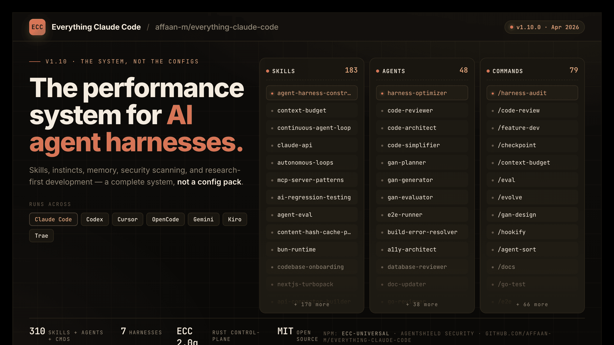

**زبان:** [English](../../README.md) | [Português (Brasil)](../pt-BR/README.md) | [简体中文](../../README.zh-CN.md) | [繁體中文](../zh-TW/README.md) | [日本語](../ja-JP/README.md) | [한국어](../ko-KR/README.md) | [Türkçe](../tr/README.md) | **فارسی**

<div dir="rtl">

# Everything Claude Code



[](https://github.com/affaan-m/everything-claude-code/stargazers)
[](https://github.com/affaan-m/everything-claude-code/network/members)
[](https://github.com/affaan-m/everything-claude-code/graphs/contributors)
[](https://www.npmjs.com/package/ecc-universal)
[](https://www.npmjs.com/package/ecc-agentshield)
[](https://github.com/marketplace/ecc-tools)
[](../../LICENSE)


> **بیش از ۱۴۰ هزار ستاره** | **بیش از ۲۱ هزار فورک** | **بیش از ۱۷۰ مشارکت‌کننده** | **۱۲+ اکوسیستم زبان** | **برنده هاکاتون Anthropic**

---

<div align="center">

**زبان / Language / 语言 / Dil**

[English](../../README.md) | [Português (Brasil)](../pt-BR/README.md) | [简体中文](../../README.zh-CN.md) | [繁體中文](../zh-TW/README.md) | [日本語](../ja-JP/README.md) | [한국어](../ko-KR/README.md) | [Türkçe](../tr/README.md) | **فارسی**

</div>

---

**سیستم بهینه‌سازی عملکرد برای هارنس‌های عامل هوش مصنوعی. از برنده هاکاتون Anthropic.**

نه فقط تنظیمات. یک سیستم کامل: مهارت‌ها، غرایز، بهینه‌سازی حافظه، یادگیری مستمر، اسکن امنیتی و توسعه اول-پژوهش. عوامل آماده تولید، مهارت‌ها، قلاب‌ها، قوانین، پیکربندی‌های MCP و جایگزین‌های دستوری قدیمی که طی بیش از ۱۰ ماه استفاده روزانه فشرده در ساخت محصولات واقعی تکامل یافته‌اند.

با **Claude Code**، **Codex**، **Cursor**، **OpenCode**، **Gemini** و سایر هارنس‌های عامل هوش مصنوعی کار می‌کند.

---

## راهنماها

این مخزن فقط کد خام است. راهنماها همه چیز را توضیح می‌دهند.

| موضوع | چه یاد می‌گیرید |
|-------|-----------------|
| بهینه‌سازی توکن | انتخاب مدل، کاهش پرامپت سیستم، فرآیندهای پس‌زمینه |
| پایداری حافظه | قلاب‌هایی که زمینه را به‌صورت خودکار ذخیره/بارگذاری می‌کنند |
| یادگیری مستمر | استخراج خودکار الگوها از جلسات به مهارت‌های قابل استفاده مجدد |
| حلقه‌های تأیید | ارزیابی‌های نقطه‌ای در برابر پیوسته، انواع درجه‌بند، معیار pass@k |
| موازی‌سازی | git worktrees، روش cascade، زمان مقیاس‌بندی نمونه‌ها |
| هماهنگی زیرعامل | مشکل زمینه، الگوی بازیابی تکراری |

---

## شروع سریع

در کمتر از ۲ دقیقه راه‌اندازی کنید:

### فقط یک مسیر را انتخاب کنید

- **پیش‌فرض توصیه‌شده:** پلاگین Claude Code را نصب کنید، سپس فقط پوشه‌های قانون مورد نظر را کپی کنید.
- **از نصب‌کننده دستی فقط زمانی استفاده کنید که** می‌خواهید کنترل دقیق‌تری داشته باشید یا می‌خواهید از مسیر پلاگین اجتناب کنید.
- **روش‌های نصب را روی هم نگذارید.** رایج‌ترین تنظیم خراب: اول `/plugin install`، سپس `install.sh --profile full`.

### مرحله ۱: نصب پلاگین (توصیه‌شده)

```bash
# افزودن مارکت‌پلیس
/plugin marketplace add https://github.com/affaan-m/everything-claude-code

# نصب پلاگین
/plugin install everything-claude-code@everything-claude-code
```

### مرحله ۲: نصب قوانین (الزامی)

```bash
# ابتدا مخزن را کلون کنید
git clone https://github.com/affaan-m/everything-claude-code.git
cd everything-claude-code

# نصب وابستگی‌ها
npm install

# مسیر نصب پلاگین: فقط قوانین را کپی کنید
mkdir -p ~/.claude/rules
cp -R rules/common ~/.claude/rules/
cp -R rules/typescript ~/.claude/rules/
```

### مرحله ۳: شروع به استفاده

```bash
# برنامه‌ریزی ویژگی جدید
/ecc:plan "احراز هویت کاربر را اضافه کن"

# بررسی دستورات موجود
/plugin list everything-claude-code@everything-claude-code
```

**همین!** اکنون به ۴۸ عامل، ۱۸۴ مهارت و ۷۹ جایگزین دستوری قدیمی دسترسی دارید.

### داشبورد گرافیکی

داشبورد دسکتاپ را برای مرور بصری اجزای ECC راه‌اندازی کنید:

```bash
npm run dashboard
# یا
python3 ./ecc_dashboard.py
```

---

## محتویات مخزن

این مخزن یک **پلاگین Claude Code** است — آن را مستقیماً نصب کنید یا اجزا را به‌صورت دستی کپی کنید.

### عوامل (`agents/`)

۴۸ زیرعامل تخصصی برای تفویض وظایف:

- `planner.md` — برنامه‌ریزی پیاده‌سازی ویژگی
- `architect.md` — تصمیمات طراحی سیستم
- `tdd-guide.md` — توسعه آزمون‌محور
- `code-reviewer.md` — بررسی کیفیت و امنیت
- `security-reviewer.md` — تحلیل آسیب‌پذیری
- `build-error-resolver.md` — رفع خطاهای ساخت
- `typescript-reviewer.md` — بررسی کد TypeScript/JavaScript
- `python-reviewer.md` — بررسی کد Python
- `go-reviewer.md` — بررسی کد Go
- `rust-reviewer.md` — بررسی کد Rust
- `java-reviewer.md` — بررسی کد Java/Spring Boot
- و بیشتر...

### مهارت‌ها (`skills/`)

تعاریف گردش کار و دانش دامنه:

- `coding-standards/` — بهترین شیوه‌های زبان
- `backend-patterns/` — الگوهای API، پایگاه داده، کش
- `frontend-patterns/` — الگوهای React، Next.js
- `tdd-workflow/` — روش‌شناسی TDD
- `security-review/` — چک‌لیست امنیتی
- `continuous-learning-v2/` — یادگیری مبتنی بر غریزه
- و بسیاری دیگر...

### قلاب‌ها (`hooks/`)

خودکارسازی‌های مبتنی بر رویداد که با رویدادهای ابزار Claude Code فعال می‌شوند.

### قوانین (`rules/`)

دستورالعمل‌های همیشه-پیروی‌شونده، سازمان‌دهی‌شده در:

- `common/` — اصول مستقل از زبان (همیشه نصب کنید)
- `typescript/` — الگوها و ابزارهای خاص TypeScript/JS
- `python/` — الگوها و ابزارهای خاص Python
- `golang/` — الگوها و ابزارهای خاص Go
- `swift/` — الگوها و ابزارهای خاص Swift
- `php/` — الگوها و ابزارهای خاص PHP

---

## ابزارهای اکوسیستم

### AgentShield — حسابرس امنیتی

پیکربندی Claude Code شما را برای آسیب‌پذیری‌ها، پیکربندی‌های نادرست و خطرات تزریق اسکن کنید.

```bash
# اسکن سریع (بدون نیاز به نصب)
npx ecc-agentshield scan

# رفع خودکار مسائل امن
npx ecc-agentshield scan --fix

# تجزیه‌وتحلیل عمیق با سه عامل Opus
npx ecc-agentshield scan --opus --stream
```

### یادگیری مستمر نسخه ۲

سیستم یادگیری مبتنی بر غریزه به‌صورت خودکار الگوهای شما را یاد می‌گیرد:

```bash
/instinct-status        # نمایش غرایز یاد گرفته‌شده با اطمینان
/instinct-import <file> # وارد کردن غرایز از دیگران
/instinct-export        # صادر کردن غرایز برای اشتراک‌گذاری
/evolve                 # خوشه‌بندی غرایز مرتبط به مهارت‌ها
```

---

## کدام عامل را استفاده کنم؟

| می‌خواهم... | از این دستور استفاده کنم | عامل مورد استفاده |
|--------------|------------------------|------------------|
| یک ویژگی جدید برنامه‌ریزی کنم | `/ecc:plan "احراز هویت اضافه کن"` | planner |
| کد تازه‌نوشته را بررسی کنم | `/code-review` | code-reviewer |
| ساخت شکسته را درست کنم | `/build-fix` | build-error-resolver |
| آسیب‌پذیری‌های امنیتی پیدا کنم | `/security-scan` | security-reviewer |
| کد مرده را حذف کنم | `/refactor-clean` | refactor-cleaner |
| مستندات را به‌روز کنم | `/update-docs` | doc-updater |
| کد Go را بررسی کنم | `/go-review` | go-reviewer |
| کد Python را بررسی کنم | `/python-review` | python-reviewer |

---

## الزامات

**حداقل نسخه Claude Code CLI: v2.1.0 یا بالاتر**

نسخه خود را بررسی کنید:

```bash
claude --version
```

---

## پشتیبانی چند پلتفرمی

این پلاگین اکنون به‌طور کامل از **ویندوز، macOS و Linux** پشتیبانی می‌کند، همراه با یکپارچه‌سازی محکم در IDEهای اصلی (Cursor، OpenCode، Antigravity) و هارنس‌های CLI.

- **Cursor**: پیکربندی‌های از پیش ترجمه‌شده در `.cursor/`
- **OpenCode**: پشتیبانی کامل پلاگین در `.opencode/`
- **Codex**: پشتیبانی درجه اول برای هر دو اپلیکیشن macOS و CLI
- **Claude Code**: بومی — این هدف اصلی است

---

## اجرای تست‌ها

```bash
npm test

# یا مستقیماً
node tests/run-all.js
```

---

## مشارکت

به ما بپیوندید! مشارکت‌های مورد نظر:

- **مهارت‌های جدید** — تعاریف گردش کار و الگوهای دامنه
- **عوامل جدید** — دستیاران تخصصی
- **قلاب‌های مفید** — خودکارسازی‌ها
- **ترجمه‌ها** — بومی‌سازی برای زبان‌های دیگر

راهنمای کامل مشارکت را در [CONTRIBUTING.md](../../CONTRIBUTING.md) ببینید.

---

## مجوز

مجوز MIT — جزئیات را در [LICENSE](../../LICENSE) ببینید.

---

## پیوندها

- [مخزن GitHub](https://github.com/affaan-m/everything-claude-code)
- [npm: ecc-universal](https://www.npmjs.com/package/ecc-universal)
- [npm: ecc-agentshield](https://www.npmjs.com/package/ecc-agentshield)
- [GitHub App: ECC Tools](https://github.com/marketplace/ecc-tools)

</div>
