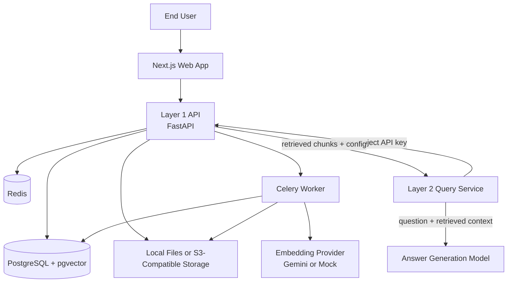
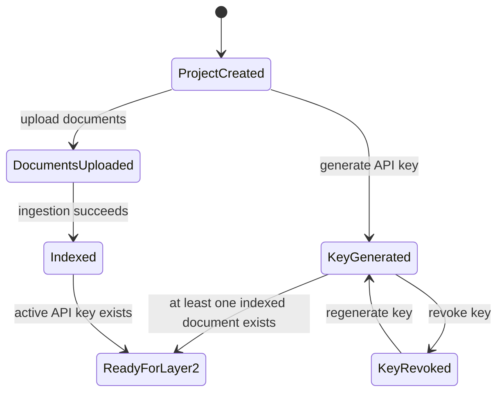
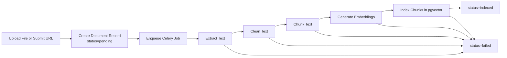
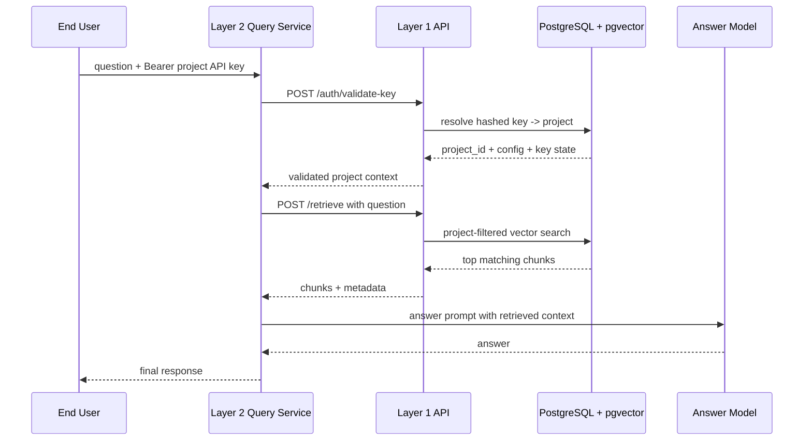
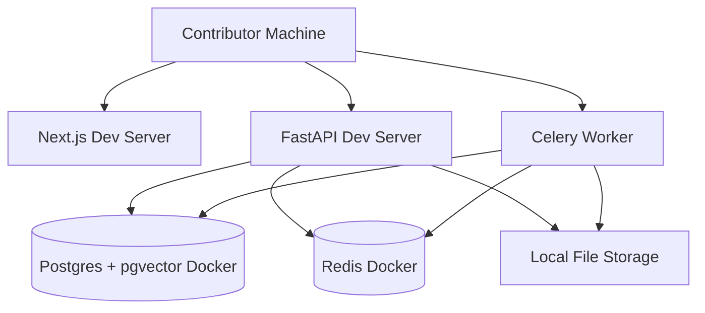

# RAG Layer 1 Demo OSS - Architecture V1

## Purpose

This document turns the locked scope in `ideasv1.md` into an implementation-ready architecture reference.

It focuses on the demo and learning version only.

## Architecture Goals

1. Keep the project local-first and open-source friendly.
2. Preserve strict project-level tenant isolation.
3. Keep Layer 1 and Layer 2 responsibilities clearly separated.
4. Support a low-cost development path with optional cloud deployment later.
5. Keep provider integrations swappable without overengineering V1.
6. Adopt proven patterns from reference implementations (rag_api, RAGFlow) rather than reinventing solved problems.

## System Overview

The system is split into two runtime layers.

1. Layer 1
   - project management
   - API keys
   - ingestion
   - indexing
   - retrieval
2. Layer 2
   - receives end-user questions
   - calls Layer 1 for key validation and retrieval
   - generates answers from retrieved context

## High-Level Architecture



## Layer Responsibilities

### Layer 1

Layer 1 is the source of truth for project data and retrieval boundaries.

Responsibilities:

1. User registration and login.
2. Project creation and update.
3. API key generation, revocation, and validation.
4. Document upload and tracking.
5. Async ingestion pipeline.
6. Chunk storage and vector indexing.
7. Retrieval within project scope.
8. Usage and audit logging.

### Layer 2

Layer 2 must stay reusable across projects.

Responsibilities:

1. Accept question requests.
2. Forward the project API key to Layer 1.
3. Ask Layer 1 to validate the key.
4. Ask Layer 1 to retrieve relevant context.
5. Build the final answer prompt.
6. Return the generated answer.

## Main Runtime Components

### 1. Next.js Web App

Responsibilities:

1. Auth screens.
2. Project dashboard.
3. API key management UI.
4. Document upload UI.
5. Document status and ingestion visibility.

### 2. FastAPI Application

Responsibilities:

1. Public and authenticated API routes.
2. JWT auth enforcement.
3. Project ownership checks.
4. Document metadata creation.
5. Retrieval endpoints for Layer 2.
6. Provider coordination.

### 3. Celery Worker

Responsibilities:

1. Pick queued ingestion jobs.
2. Read source file or fetched URL content.
3. Extract raw text via LangChain document loaders (`PyPDFLoader`, `UnstructuredWordDocumentLoader`, `TextLoader`).
4. Clean and normalize text.
5. Chunk text using per-project `chunking_strategy`:
   - `naive` — fixed-size sliding window with overlap (default)
   - `qa` — split on Q&A pair boundaries
   - `one` — entire document as a single chunk
6. Embed chunks in batches using `EMBEDDING_BATCH_SIZE` to bound memory usage.
7. Upsert vectors and metadata into PostgreSQL in batch-aligned transactions.
8. Update document lifecycle state.

### 4. PostgreSQL + pgvector

Responsibilities:

1. Persist relational application data.
2. Persist chunk metadata.
3. Persist embeddings.
4. Execute project-filtered vector retrieval.

### 5. Redis

Responsibilities:

1. Celery broker.
2. Simple short-lived rate limit counters.
3. Optional lightweight job coordination.

### 6. File Storage

Dev mode:

1. Local filesystem storage.

Cloud mode later:

1. S3-compatible object storage.

Responsibilities:

1. Store raw uploaded files.
2. Optionally store extracted artifacts.
3. Keep API and worker decoupled from file transport.

## Project Config Schema

Stored per project. Governs chunking and retrieval behavior.

| Field | Type | Default | Notes |
|---|---|---|---|
| `chunking_strategy` | enum | `naive` | `naive`, `qa`, or `one` |
| `chunk_size` | int | 512 | Tokens. Only applies when strategy is `naive` |
| `chunk_overlap` | int | 64 | Tokens. Only applies when strategy is `naive` |
| `embedding_model` | string | `gemini-embedding-2` | Provider-qualified model name |
| `top_k` | int | 5 | Max chunks returned per retrieval query |

Config is set at project creation and editable before any documents are indexed. Re-indexing is required after config changes (V1.1 feature).

## Chunking Strategy Detail

| Strategy | Splitting Logic | Best Use |
|---|---|---|
| `naive` | Fixed token window with `chunk_overlap` sliding overlap | Default for general documents |
| `qa` | Split on `Q:` / `A:` pattern boundaries | FAQ docs, support knowledge bases |
| `one` | Entire document text as a single chunk | Very short docs, metadata-only lookups |

Inspired by RAGFlow's template-based chunking concept (Apache-2.0).

## Multi-Tenancy and Isolation Model

Each project is the tenant boundary.

Rules:

1. A user may own multiple projects.
2. Each project has its own config (see Project Config Schema).
3. Each project has one active API key at a time.
4. Each project has its own document set.
5. Retrieval must always filter by `project_id`.
6. Layer 2 must never choose a project directly without key validation.

## Project Lifecycle



## Document Ingestion Flow



## Ingestion State Machine

Document state transitions:

1. `pending`
2. `processing`
3. `indexed`
4. `failed`

Operational meaning:

1. `pending`
   - metadata row exists
   - work not started yet
2. `processing`
   - one of extraction, cleaning, chunking, embedding, or indexing is running
3. `indexed`
   - chunks and vectors are queryable
4. `failed`
   - processing stopped with an error reason

## Retrieval Flow Between Layer 2 and Layer 1



## API Key Model

Format:

`rag_<env>_<projectId>_<random64hex>`

Rules:

1. Plaintext key shown once.
2. Only hash stored in database.
3. One active key per project.
4. Key validation resolves the project.
5. Key generation is separate from ingestion.

## Data Ownership by Component

### FastAPI owns

1. auth flows
2. projects
3. configs
4. API keys
5. document records
6. retrieval APIs

### Worker owns

1. extraction execution
2. cleaning logic
3. chunk generation
4. embedding calls
5. indexing writes

### PostgreSQL owns

1. user data
2. project data
3. configs
4. document metadata
5. chunk metadata
6. embeddings
7. usage events
8. audit logs

## Storage Strategy

### Local mode

1. Uploaded files stored on local disk.
2. Best for open-source contributors.
3. Zero mandatory cloud cost.

### Cloud mode later

1. Use S3-compatible storage.
2. Keep the same object storage interface.
3. Avoid changing business logic when moving to hosted infrastructure.

## Provider Abstraction Boundaries

These interfaces should exist in the implementation design.

| Interface | V1 Implementation | Notes |
|---|---|---|
| `EmbeddingProvider` | Gemini Embedding 2 | Mock adapter for $0 local dev |
| `VectorStore` | pgvector | IVFFlat index |
| `ObjectStorage` | Local filesystem | S3-compatible adapter later |
| `Extractor` | LangChain loaders (`PyPDFLoader`, `UnstructuredWordDocumentLoader`, `TextLoader`) | Adopted from rag_api pattern |
| `QueueBackend` | Celery + Redis | Upstash Redis for cloud mode |
| `ChunkingStrategy` | `naive` / `qa` / `one` factory | Per-project config selects implementation |

For V1, each interface should have one real implementation plus optional mock implementations for local development where helpful.

## Batch Embedding Architecture

Adopted from `rag_api` (MIT license). Prevents memory exhaustion on large files.

```
Chunk Stream
    │
    ▼
[Chunk Buffer]
    │   EMBEDDING_BATCH_SIZE chunks (default 256)
    ▼
[Embedding API call]
    │   batch of vectors
    ▼
[pgvector upsert transaction]
    │   committed per batch
    ▼
[next batch or done]
```

Rules:
1. Batch size is configurable via `EMBEDDING_BATCH_SIZE` env var (default 256).
2. Each batch is embedded and inserted before the next starts.
3. On batch failure, only that batch is rolled back — prior committed batches are preserved.
4. Memory usage is bounded by `EMBEDDING_BATCH_SIZE × vector_dimension_bytes`.

## Deployment Modes

### Local OSS Mode



### Optional Cloud Demo Mode Later

1. Frontend on Vercel.
2. API on Railway.
3. Worker on Railway.
4. PostgreSQL hosted service.
5. Redis hosted service.
6. S3-compatible object storage.

## Security Boundaries

1. End-user auth uses JWT.
2. Project access is owned by authenticated user checks.
3. Retrieval access uses project-scoped API keys.
4. Retrieval always resolves project from key hash lookup.
5. Internal project ID filtering is mandatory on every retrieval query.

## Demo Constraints Reflected in Architecture

1. File types limited to PDF, DOCX, and TXT.
2. No OCR path.
3. No audio or video path.
4. No recursive web crawling.
5. No enterprise orchestration or billing services.

## Recommended Build Sequence

1. Core API foundation.
2. Auth and projects.
3. API key lifecycle.
4. File upload and document records.
5. Worker extraction and chunking.
6. Embedding and pgvector indexing.
7. Retrieval endpoints.
8. Layer 2 integration.
9. Frontend dashboard.
10. Local Docker developer experience.

## Reference Implementation Credits

| Project | License | What was adopted |
|---|---|---|
| [rag_api](https://github.com/danny-avila/rag_api) | MIT | Batch embedding pattern, LangChain loader approach, provider enum pattern |
| [RAGFlow](https://github.com/infiniflow/ragflow) | Apache-2.0 | Template-based chunking strategy concept |

No source code was copied. Patterns were studied and reimplemented within this project's architecture.

## Open Questions To Lock Before Coding

1. Whether URL ingestion ships in V1 or V1.1.
2. Whether `POST /retrieve` is exposed publicly or only intended for Layer 2.
3. Whether mock embeddings are deterministic for tests.
4. Whether extracted text artifacts are persisted by default in V1.
5. Confirm default `EMBEDDING_BATCH_SIZE` value (256 proposed, tune after testing).

## Success Criteria for This Architecture

1. Contributors can run the system locally with Docker.
2. One project cannot retrieve another project's vectors.
3. Layer 2 can serve many projects without rebuild.
4. Demo scope stays small enough to implement without enterprise infrastructure.
5. The system can grow later by swapping providers behind stable interfaces.